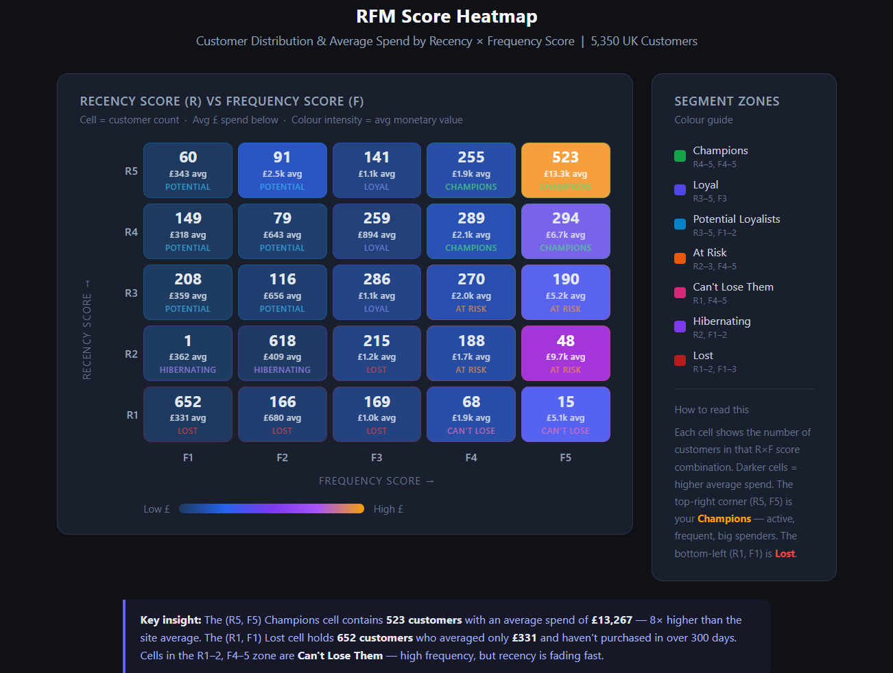
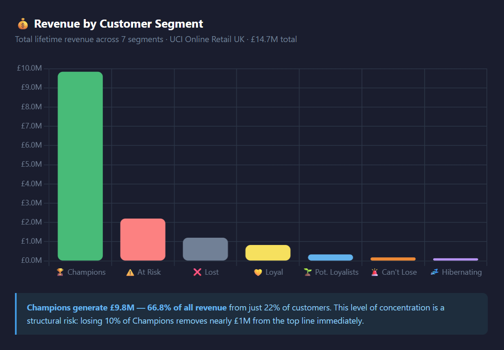
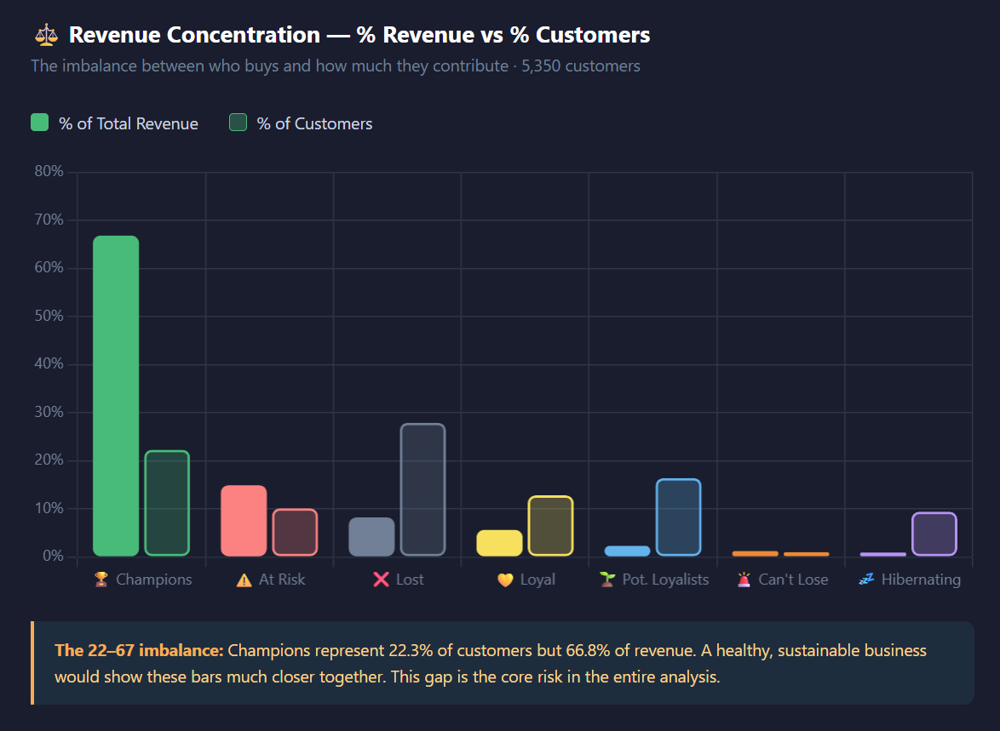
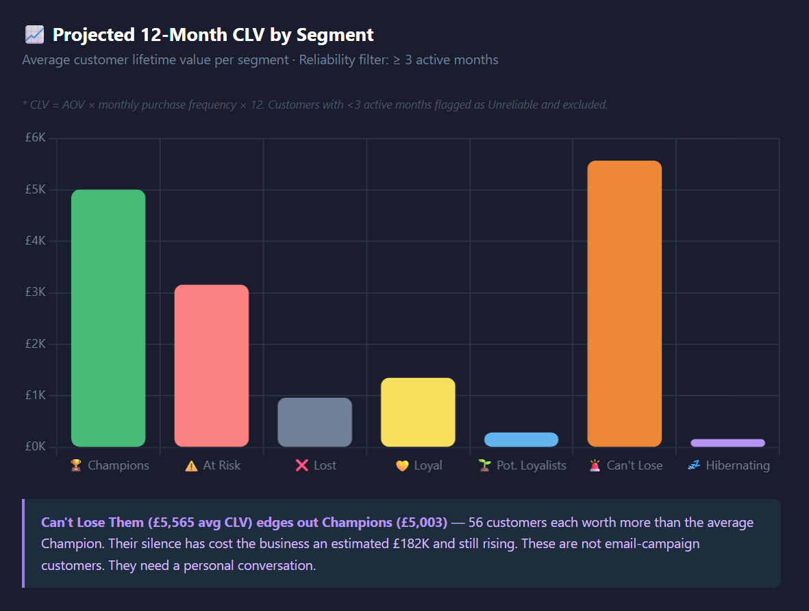
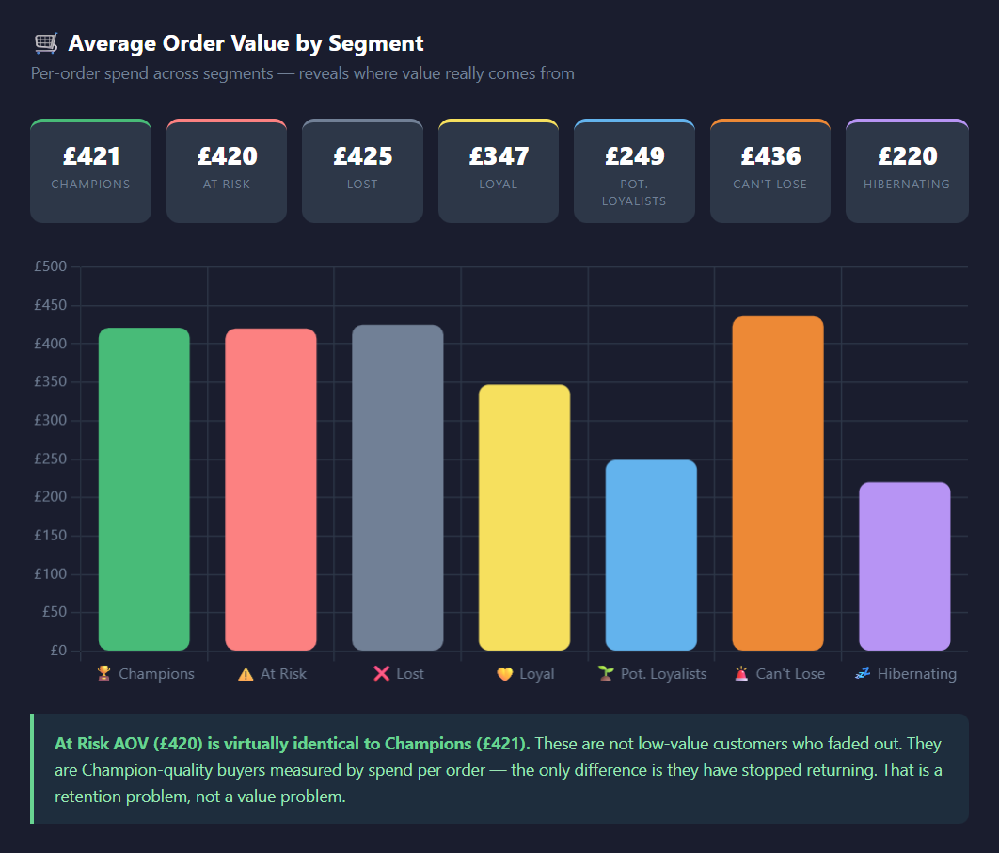
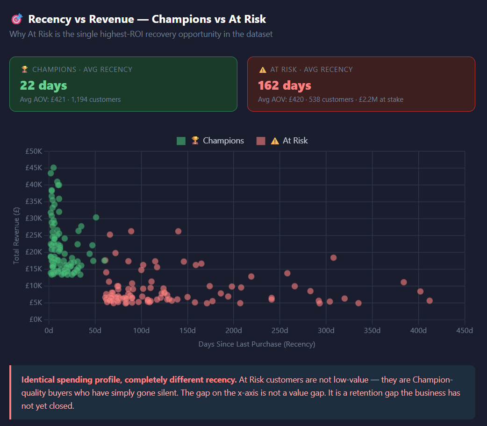

# RFM Segmentation & Customer Lifetime Value Analysis


**UK Market · Dec 2010 – Dec 2011 · 5,350 customers · £14.7M revenue**

## 📊 Interactive Dashboard

Explore the full interactive RFM & CLV dashboard:

👉 **[View Live Dashboard](https://sandu17767.github.io/-RFM-Segmentation-Customer-Lifetime-Value-Analysis/dashboard.html)**

---


## 📊 Key Visual Insights

### 🔥 RFM Segmentation Overview


This heatmap shows how customers are distributed across recency and frequency, highlighting high-value clusters.

---

### 💰 Revenue by Segment


Champions generate 66.8% of total revenue, showing strong dependence on a small customer group.

---

### ⚠️ Revenue Concentration


A small percentage of customers drive the majority of revenue, creating structural risk.

---

### 📈 CLV by Segment


Customer lifetime value varies significantly across segments, with Champions dominating long-term value.

---

### 🛒 Average Order Value


At Risk customers show similar spending behaviour to Champions, indicating recovery potential.

---

### 🔄 Recency vs Revenue


Customers with high revenue but declining recency represent key churn risk.

---


## 🎯 The Business Problem

22% of customers are generating 67% of revenue — and nobody is protecting them.

This project segments 5,350 UK e-commerce customers using RFM analysis and Customer Lifetime Value modelling to answer the questions a CRM or retention team actually needs answered:

- Which customers are driving the business — and are they being protected?
- Who is at risk right now, and how much revenue can still be recovered?
- Where should the retention budget go, and in what order?

→ [Read the full analysis](./executive_summary.md)

---

## 📊 Segment Results

| Segment | Customers | Revenue | % of Revenue | Avg Customer Value |
|---|---|---|---|---|
| 🏆 Champions | 1,194 | £9.80M | 66.8% | £8,238 |
| ⚠️ At Risk | 538 | £2.20M | 14.9% | £4,089 |
| ❌ Lost | 1,495 | £1.20M | 8.2% | £805 |
| 💛 Loyal | 687 | £826K | 5.6% | £1,203 |
| 🌱 Potential Loyalists | 876 | £337K | 2.3% | £385 |
| 🚨 Can't Lose Them | 56 | £182K | 1.2% | £3,242 |
| 💤 Hibernating | 504 | £138K | 0.9% | £274 |

---

## 🔍 What the Data Revealed

**1. The business is running on a single point of failure**

22% of customers generate 66.8% of revenue. This is not a sign of strength — it is a structural fragility. There is no formal programme protecting Champions, and no early-warning system to catch them before they go silent. Losing 10% of this segment removes nearly £1M from the top line immediately.

**2. £2.38M is actively at risk — and these are Champion-quality buyers**

At Risk and Can't Lose Them customers have an average order value of £420–£436 — identical to Champions. They have not downgraded. They have not complained. They simply stopped buying, and the business did not notice. The window to recover them is still open.

**3. 47% of Lost customers were never going to stay**

Nearly half of the Lost segment placed only a single order. This is not purely a retention failure — it is an acquisition quality problem. There is no second-purchase mechanism to catch new buyers in the critical 30-day window after their first order.

**4. 876 warm customers are still reachable — but the window is closing**

Potential Loyalists purchased an average of 67 days ago. Research consistently shows second-purchase conversion probability drops sharply after 30 days. This is the highest-conversion, most time-sensitive opportunity in the dataset.

---

## 💡 Business Recommendations

**1. 🔒 Protect Champions — launch a VIP programme immediately**

Champions are not self-managing. A tiered loyalty programme — early product access, personalised rewards, priority service — creates switching cost that converts a transactional relationship into a durable one. Set a churn early-warning trigger at 60 days inactivity so no Champion goes silent unnoticed.

**2. ⚠️ Win back At Risk customers — £440K recoverable from 20% conversion**

538 customers, £2.2M at risk, Champion-level AOV. A personalised win-back campaign triggered at 120–150 days inactivity — referencing specific purchase history, with a time-limited offer — is the single highest-ROI retention action available. Recovering just 20% returns £440K.

**3. 🚨 Give Can't Lose Them a personal conversation, not an email**

56 customers averaging £3,242 each. The ROI at this value level justifies direct, personal outreach — not an automated sequence. Recovering 50% of this group at historical spend rate returns £90K+.

**4. 🌱 Convert Potential Loyalists within 30 days or lose them permanently**

A triggered second-purchase sequence within 30 days of first order — category-specific product recommendations, not a generic discount — is the most scalable conversion mechanism in the dataset. After 30 days, recovery cost rises sharply.

**5. ❌ Stop over-investing in Lost — implement a sunset strategy**

47% of Lost customers were one-time buyers. The commercial call is a single low-cost annual reactivation campaign, nothing more. A structured sunset process — removing persistently unengaged contacts from active lists — protects email deliverability and redirects budget toward segments with real recovery potential.

---

## ⚙️ Key Analytical Decisions

| Decision | Why it mattered |
|---|---|
| Reference date set to `2011-12-11` not `2011-12-01` | Using Dec 1 produced negative recency values for customers transacting Dec 1–9 — silently corrupting every recency score in the dataset |
| Cancellations excluded before scoring | Leaving cancellation invoices in inflated frequency and monetary values, making disengaged customers appear active |
| CLV reliability filter: 3+ active months | Prevents a single large order from generating a misleadingly inflated 12-month projection |
| NTILE(5) relative scoring | Scores customers relative to each other, not against absolute benchmarks — a deliberate trade-off acknowledged in model limitations |

---

## 🛠️ Tools & Skills

| Area | Detail |
|---|---|
| **Language** | BigQuery Standard SQL |
| **Techniques** | CTEs, window functions, NTILE scoring, conditional aggregation, CLV projection |
| **Segmentation** | 7 RFM segments via custom CASE classification logic |
| **CLV Modelling** | AOV × monthly frequency × 12-month projection with reliability flag |
| **Visualisation** | Power BI — KPI cards, revenue by segment, recency vs monetary scatter, AOV comparison |
| **Business framing** | Every segment translated into a prioritised commercial action with ROI rationale |

---

## Repository Structure
```
rfm-segmentation-clv/
│
├── README.md                     ← Project overview and key findings
├── executive_summary.md          ← This document
│
├── sql/
│   ├── 01_raw_rfm.sql            ← Recency, frequency, monetary values
│   ├── 02_rfm_scores.sql         ← NTILE(5) scoring
│   ├── 03_segments.sql           ← Segment classification logic
│   ├── 04_segment_summary.sql    ← Segment-level aggregation
│   ├── 05_clv.sql                ← CLV with reliability flag
│   └── 06_master_table.sql       ← Combined RFM + CLV master dataset
│
├── data/
│   └── rfm_final.csv             ← Master output (5,350 customers)
│
└── dashboard/
    └── rfm_dashboard.png         ← Power BI dashboard screenshot
```

## 👤 About This Project

This is one of five projects in an e-commerce analytics portfolio built to demonstrate real business thinking — not academic exercises.

The goal was not to build a clean model. The goal was to answer the questions a Head of CRM, a Retention Manager, or a Marketing Director at an e-commerce business would actually need answered — and to connect every data finding to a specific commercial decision with a clear rationale.

---

*Dataset: UCI Machine Learning Repository — Online Retail Dataset*
*UK customers only · Dec 2010 – Dec 2011 · BigQuery Standard SQL · Power BI*
